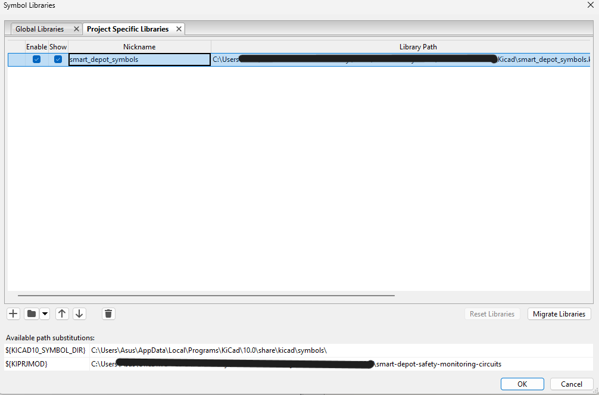
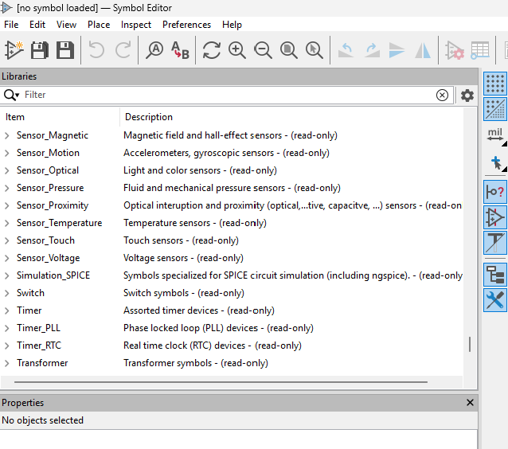
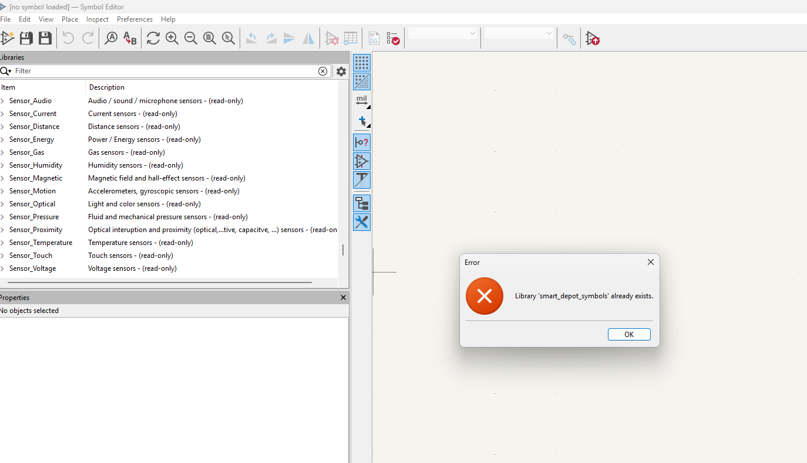
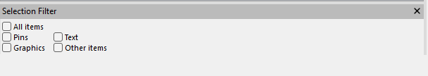
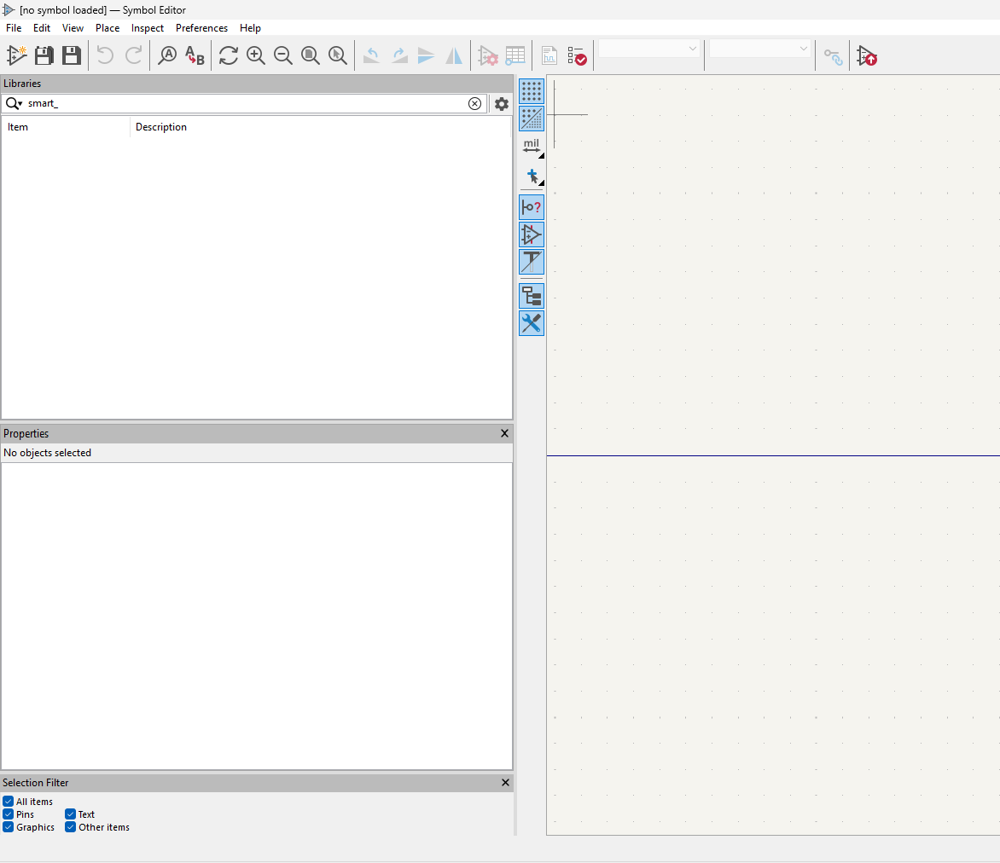
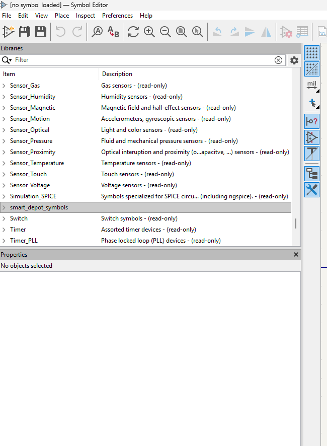

# KiCad Debugging Notes

This document records setup/debugging issues encountered while creating KiCad schematics for the **STM32 Smart Depot Safety and Access Monitoring** project.

---

## Issue 1: Project-Specific Symbol Library Not Showing in Symbol Editor

### Context

A project-specific custom symbol library was created to store reusable symbols for this project, including:

- STM32 Nucleo-F446RE module block
- PIR motion sensor block
- Active buzzer module block
- Other project-specific schematic symbols

Library name:

```text
smart_depot_symbols
```

The library was created as a **project-specific library** so it could remain linked to this repository instead of being stored globally on the computer.

---

## Problem

The library appeared under:

```text
Preferences → Manage Symbol Libraries → Project Specific Libraries
```

It was also enabled and set to show.

However, it did not appear in the **Symbol Editor** library list, so it could not be selected when creating a new custom PIR sensor symbol.

---

## Evidence

The library was visible in the Project Specific Libraries table:



However, it did not appear in the Symbol Editor list:



When trying to add the same library again, KiCad showed:

```text
Library 'smart_depot_symbols' already exists.
```



This confirmed that the library already existed, but KiCad had not refreshed it properly in the Symbol Editor.

---

## Troubleshooting Steps

The following steps were attempted:

1. Checked that `smart_depot_symbols` existed under:

```text
Preferences → Manage Symbol Libraries → Project Specific Libraries
```

2. Confirmed that both options were selected:

```text
Enable: ticked
Show: ticked
```

3. Cleared the Symbol Editor filter.


5. Searched using different terms:

```text
smart_
depot
symbols
```

The library still did not appear in the filter results.



5. Closed and reopened the Symbol Editor.

6. Removed the library entry from **Manage Symbol Libraries** and added the existing file again to force KiCad to reload it:

```text
smart_depot_symbols.kicad_sym
```

After re-adding it, `Enable` and `Show` were checked again, but the library still did not appear immediately.

7. Avoided creating a duplicate library because KiCad already confirmed that `smart_depot_symbols` existed.

---

## Final Fix

The issue was resolved by restarting the whole KiCad application.

After restarting KiCad, the library appeared in the Symbol Editor list:



The filter still did not show the library clearly because it was empty at the time. Since no symbols had been created inside it yet, the library had to be found by manually scrolling through the Symbol Editor library list.

---

## Lesson Learned

When a new project-specific symbol library does not appear in the Symbol Editor:

1. Check that it exists under **Project Specific Libraries**.
2. Confirm `Enable` and `Show` are ticked.
3. Clear the Symbol Editor filter.
4. Close and reopen the Symbol Editor.
5. Remove and re-add the existing `.kicad_sym` file to force a reload.
6. Restart the whole KiCad application if it still does not appear.
7. If the library is empty, manually scroll through the library list instead of relying only on the filter.

In this case, removing and re-adding the library did not fix the issue. Restarting KiCad fixed it.

---

## Outcome

After restarting KiCad, the `smart_depot_symbols` library became available in the Symbol Editor.

This allowed custom project symbols, such as the PIR motion sensor block, to be created for the schematic documentation.

---

## Screenshot Folder

Screenshots for this issue are stored in:

```text
images/kicad-debugging/custom-symbol-library/
```

Files used:

```text
01-project-library-enabled.png
02-library-not-visible-in-symbol-editor.png
03-library-already-exists-error.png
04-symbol-editor-filter-no-results.png
05-library-visible-after-restart.png
06-selection-filter-cleared.png
```
