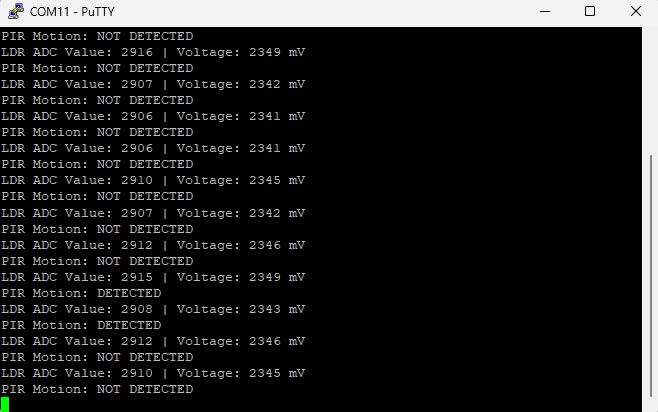

# 02 - PIR Motion Sensor Circuit

## Purpose

This circuit is used to detect motion in the monitored depot area. The PIR motion sensor detects movement by sensing changes in infrared radiation, usually caused by a person moving within its detection range.

This is the second sensing stage of the Smart Depot Safety and Access Monitoring System. It will later be combined with the LDR circuit so that motion detection can be used more meaningfully during **Night Monitoring Mode**.

## Circuit Concept

The PIR motion sensor provides a digital output signal. The output behaves as follows:

```text
No motion detected → LOW
Motion detected    → HIGH
```

This means the STM32 reads the PIR output using a GPIO input pin.

## Components Used

| Component                  | Purpose                                      |
| -------------------------- | -------------------------------------------- |
| STM32 Nucleo F446RE        | Main microcontroller                         |
| HC-SR501 PIR motion sensor | Detects motion                               |
| Breadboard                 | Circuit prototyping                          |
| Jumper wires               | Connections between the PIR sensor and STM32 |

## Pin Connections

| PIR Sensor Pin | STM32 Connection | Purpose                                |
| -------------- | ---------------- | -------------------------------------- |
| VCC            | 5V               | Powers the PIR sensor                  |
| OUT            | PA1 / GPIO input | Sends motion detection signal to STM32 |
| GND            | GND              | Common ground reference                |

## Why GPIO Input Is Used

The PIR sensor provides a digital output signal, meaning the signal is either HIGH or LOW. Because of this, the STM32 does not need to measure a range of voltages using the ADC.

Instead, PA1 is configured as a GPIO input. The STM32 reads this pin to determine whether motion has been detected.

```c
HAL_GPIO_ReadPin(PIR_MOTION_INPUT_GPIO_Port, PIR_MOTION_INPUT_Pin);
```

If the pin reads `GPIO_PIN_SET`, motion has been detected. If the pin reads `GPIO_PIN_RESET`, no motion is detected.

## CubeMX Configuration

The project was updated in STM32CubeMX using the same STM32CubeIDE project as the LDR test.

| Peripheral / Pin    | Configuration                   |
| ------------------- | ------------------------------- |
| PA1                 | GPIO Input                      |
| User Label          | PIR_MOTION_INPUT                |
| Pull-up / Pull-down | No pull-up and no pull-down     |
| USART2              | Used for serial output to PuTTY |

The PIR sensor module drives its output pin HIGH or LOW, so no internal pull-up or pull-down resistor was enabled for the first test.

## Firmware Test

The STM32 reads the PIR sensor output from PA1 and sends the result over USART2 to PuTTY through the ST-LINK Virtual COM Port.

The firmware prints one of two messages:

```text
PIR Motion: DETECTED
PIR Motion: NOT DETECTED
```

The PIR reading was tested together with the existing LDR ADC reading, allowing both light-level and motion status to be viewed in PuTTY.

Example serial output:

```text
PIR Motion: NOT DETECTED
LDR ADC Value: 2904 | Voltage: 2340 mV
PIR Motion: NOT DETECTED
LDR ADC Value: 2902 | Voltage: 2338 mV
```

## Test Result

The PIR motion sensor was successfully read by the STM32 through PA1. The serial output confirmed that the STM32 can receive and display the PIR motion status through USART2.

During the test, PuTTY displayed:



This confirms that the PIR sensor input is being read by the firmware. 

## Important Testing Note

The HC-SR501 PIR sensor usually needs a short warm-up period after power is applied. During this time, the output may be unstable. For reliable testing, the sensor should be powered for around 30–60 seconds before checking the motion output.

## Next Step

The next step is to combine the PIR logic with the LDR threshold so that motion alerts are only triggered when the system is in Night Monitoring Mode.
