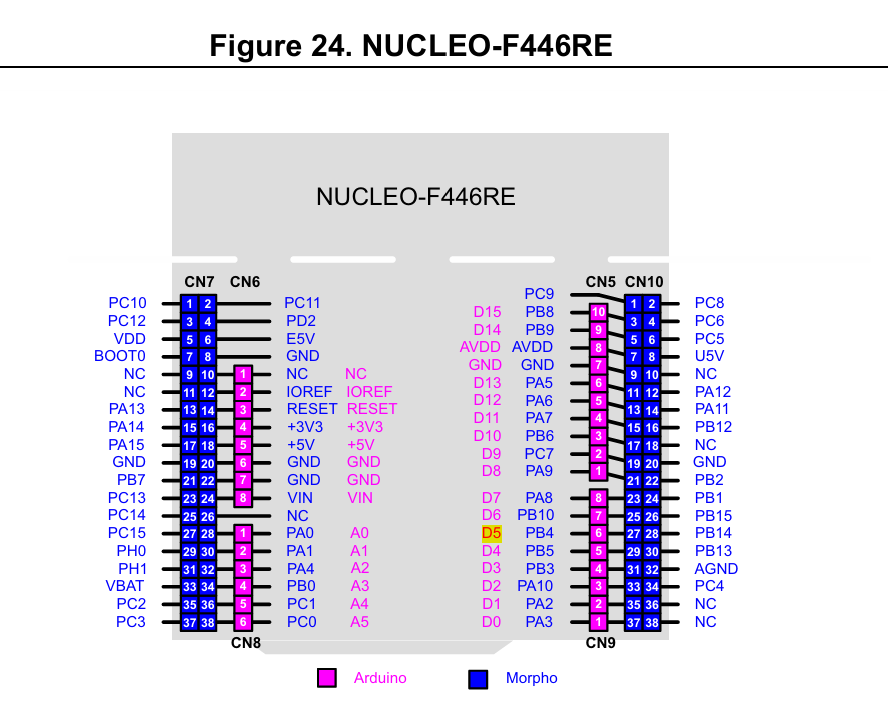
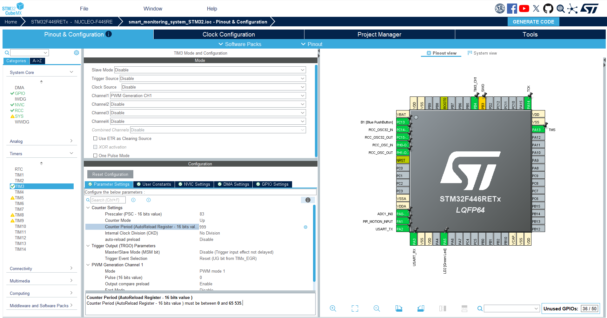
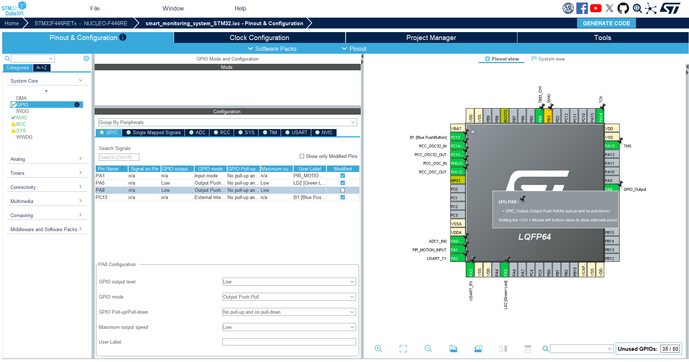

# 03 - Security Light and Warning LED Circuits

## Purpose

This circuit adds two visual output indicators to the Smart Depot Safety and Access Monitoring System:

- **Security Light LED**: represents the main depot safety/security light that would illuminate the monitored area when visibility is low. In the prototype, it is controlled using PWM so that different brightness levels can represent different system modes. For example, it stays off during Day Mode, turns on at low brightness during Night Monitoring Mode, and increases to high brightness during Alert Mode.

- **Warning LED**: represents a separate alert indicator used to signal a potential security or safety event. Unlike the security light, it does not need brightness control. It simply turns ON when an alert condition is detected, such as motion being detected during Night Monitoring Mode, and can blink later during Fault Mode to show an abnormal system condition.

These LEDs will later be controlled using the LDR and PIR sensor readings. The security light will respond to the light level, while the warning LED will respond to alert conditions.

## Circuit Concept

The system uses two separate LEDs, each with its own 220Ω current-limiting resistor.

The **Security Light LED** is connected to a PWM-capable pin so its brightness can be controlled. This allows it to represent different operating modes:

```text
Day Mode             → Security Light OFF
Night Monitoring Mode → Security Light LOW brightness
Alert Mode           → Security Light HIGH brightness
```

The **Warning LED** is connected to a normal GPIO output pin because it only needs simple ON/OFF control. It will be used for alert and fault indication:

```text
Alert Mode → Warning LED ON
Fault Mode → Warning LED blinking
```

## Components Used

| Component           | Purpose                                                |
| ------------------- | ------------------------------------------------------ |
| STM32 Nucleo F446RE | Main microcontroller                                   |
| Yellow LED          | Security light indicator                               |
| Red LED             | Warning / alert indicator                              |
| 220Ω resistor x2    | Limits current through each LED                        |
| Breadboard          | Circuit prototyping                                    |
| Jumper wires        | Connections between STM32, resistors, LEDs, and ground |

## Pin Mapping

The NUCLEO-F446RE pinout reference was used to map the Arduino header pins to the STM32 microcontroller pins.



Based on this mapping:

| Function           | Arduino Pin | STM32 Pin | CubeMX Configuration |
| ------------------ | ----------: | --------- | -------------------- |
| Security Light LED |          D5 | PB4       | TIM3_CH1 PWM         |
| Warning LED        |          D7 | PA8       | GPIO Output          |

## Pin Connections

### Security Light LED

| Component Pin                  | STM32 Connection               | Purpose                |
| ------------------------------ | ------------------------------ | ---------------------- |
| Yellow LED anode / long leg    | D5 / PB4 through 220Ω resistor | PWM brightness control |
| Yellow LED cathode / short leg | GND                            | Ground return path     |

Connection:

```text
D5 / PB4 → 220Ω resistor → Yellow LED anode
Yellow LED cathode → GND
```

### Warning LED

| Component Pin               | STM32 Connection               | Purpose                |
| --------------------------- | ------------------------------ | ---------------------- |
| Red LED anode / long leg    | D7 / PA8 through 220Ω resistor | Digital warning output |
| Red LED cathode / short leg | GND                            | Ground return path     |

Connection:

```text
D7 / PA8 → 220Ω resistor → Red LED anode
Red LED cathode → GND
```

## Why Each LED Uses Its Own Resistor

Each LED requires its own current-limiting resistor. The resistor controls the current flowing through that specific LED and protects both the LED and the STM32 GPIO pin.

A single shared resistor should not be used for both LEDs because the current would not be controlled properly for each LED. This could cause uneven brightness, unpredictable behaviour, or excessive current through one of the LEDs.

The 220Ω resistors were used because they are a common safe value for standard LEDs connected to a 3.3V microcontroller output.

## Why PWM Is Used for the Security Light LED

The security light LED needs more than simple ON/OFF control. It represents different lighting levels depending on the system mode.

PWM, or Pulse Width Modulation, allows the STM32 to switch the LED ON and OFF very quickly. By changing the duty cycle, the perceived brightness of the LED changes.

For example:

```text
PWM compare value 0   → LED OFF
PWM compare value 200 → Low brightness
PWM compare value 999 → High brightness
```

PB4 was configured as `TIM3_CH1`, allowing Timer 3 Channel 1 to control the LED brightness.

## Why GPIO Output Is Used for the Warning LED

The warning LED only needs to turn ON, turn OFF, or blink. It does not require brightness control, so a normal GPIO output pin is enough.

PA8 was configured as a GPIO output. The STM32 can set this pin HIGH to turn the warning LED ON, or LOW to turn it OFF.

```c
HAL_GPIO_WritePin(WARNING_LED_GPIO_Port, WARNING_LED_Pin, GPIO_PIN_SET);   // Warning LED ON
HAL_GPIO_WritePin(WARNING_LED_GPIO_Port, WARNING_LED_Pin, GPIO_PIN_RESET); // Warning LED OFF
```

## CubeMX Configuration

The existing STM32CubeIDE project was updated in STM32CubeMX to add the two LED outputs.

| Peripheral / Pin        | Configuration               |
| ----------------------- | --------------------------- |
| PB4                     | TIM3_CH1 PWM                |
| PB4 User Label          | SECURITY_LIGHT_PWM          |
| TIM3 Prescaler          | 83                          |
| TIM3 Counter Period     | 999                         |
| TIM3 Pulse              | 0                           |
| PA8                     | GPIO Output                 |
| PA8 User Label          | WARNING_LED                 |
| PA8 Output Type         | Output Push Pull            |
| PA8 Pull-up / Pull-down | No pull-up and no pull-down |
| PA8 Output Speed        | Low                         |

### Security Light PWM Configuration

PB4, which corresponds to Arduino pin D5 on the Nucleo-F446RE, was configured as `TIM3_CH1` for PWM output.



### Warning LED GPIO Configuration

PA8, which corresponds to Arduino pin D7 on the Nucleo-F446RE, was configured as a GPIO output for the warning LED.



## Firmware Test

The firmware was updated to start PWM on TIM3 Channel 1 and control the warning LED through GPIO.

PWM was started using:

```c
HAL_TIM_PWM_Start(&htim3, TIM_CHANNEL_1);
```

The security light LED brightness was tested by changing the PWM compare value:

```c
__HAL_TIM_SET_COMPARE(&htim3, TIM_CHANNEL_1, 200); // Low brightness
__HAL_TIM_SET_COMPARE(&htim3, TIM_CHANNEL_1, 999); // High brightness
```

The warning LED was tested using:

```c
HAL_GPIO_WritePin(WARNING_LED_GPIO_Port, WARNING_LED_Pin, GPIO_PIN_SET);   // ON
HAL_GPIO_WritePin(WARNING_LED_GPIO_Port, WARNING_LED_Pin, GPIO_PIN_RESET); // OFF
```

## Test Result

The circuit successfully controlled both LEDs.

Observed behaviour:

```text
Security Light LED → changed between low and high brightness
Warning LED        → turned ON and OFF
```

This confirms that the STM32 can control a PWM-based output for brightness control and a GPIO-based output for simple warning indication.

## Next Step

The next step is to combine the LED outputs with the LDR and PIR logic:

```text
Day Mode:
Security Light OFF
Warning LED OFF

Night Monitoring Mode:
Security Light LOW brightness
Warning LED OFF

Alert Mode:
Security Light HIGH brightness
Warning LED ON

Fault Mode:
Warning LED blinking
```

This will move the project from individual circuit testing into full system behaviour.
