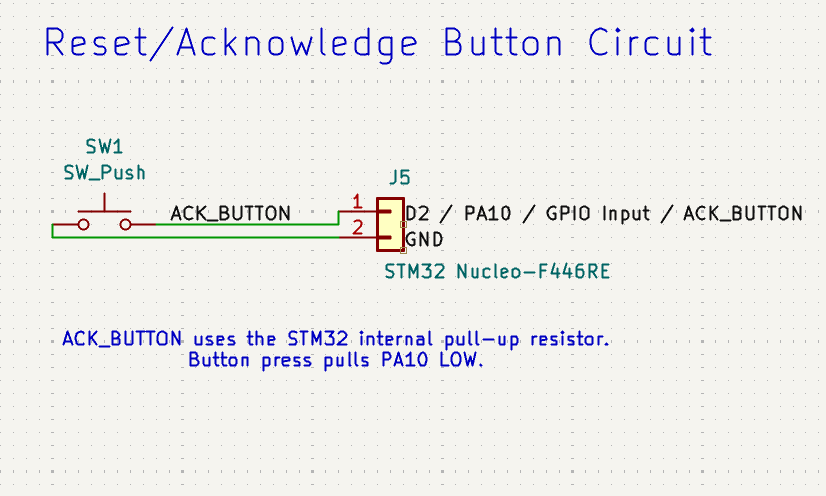

# 05 - Reset / Acknowledge Button Circuit

## Purpose

This circuit adds a manual reset/acknowledge input to the Smart Depot Safety and Access Monitoring System.

The button allows a user to acknowledge an alert after the system detects a safety or security event. For example, if motion is detected at night and the warning LED and buzzer are activated, pressing the button can tell the STM32 that the alert has been seen and should be reset.

## Circuit Concept

The reset/acknowledge button is a digital input circuit. Unlike the LED, buzzer, or security light, the button does not power another component directly. Instead, it provides an input signal that the STM32 reads in software.

The button is connected between **D2 / PA10** and **GND**, with the STM32 internal pull-up resistor enabled.

```text
D2 / PA10 → one side of push button
GND       → other side of push button
```

With the internal pull-up enabled, the button uses active-low logic:

```text
Button not pressed → D2 / PA10 pulled HIGH
Button pressed     → D2 / PA10 connected to GND → LOW
```

The STM32 then uses this input to decide what should happen next. In the final system, pressing the button can acknowledge an alert, turn off the warning outputs, and return the system to monitoring mode.

## Components Used

| Component           | Purpose                                          |
| ------------------- | ------------------------------------------------ |
| STM32 Nucleo F446RE | Main microcontroller                             |
| Push button         | Allows the user to acknowledge or reset an alert |
| Jumper wires        | Electrical connections                           |
| Breadboard          | Circuit prototyping                              |

### Reset/Acknowledge Button Circuit Schematic


## Why an Internal Pull-up Is Used

The STM32 internal pull-up resistor is enabled so that the input pin has a clear default state when the button is not pressed.

Without a pull-up or pull-down resistor, the input pin could float. A floating input is not clearly HIGH or LOW, so the STM32 may read random values and the button behaviour may become unreliable.

With the internal pull-up enabled:

```text
Not pressed:
D2 / PA10 is weakly connected to 3.3V internally → HIGH

Pressed:
D2 / PA10 is connected to GND through the button → LOW
```

This means no external resistor is required, which keeps the circuit simple.

## Button Logic

| Button State | Pin State         | STM32 Reads    |
| ------------ | ----------------- | -------------- |
| Not pressed  | Pulled up to 3.3V | GPIO_PIN_SET   |
| Pressed      | Connected to GND  | GPIO_PIN_RESET |

Because the button is active-low, the firmware should check for `GPIO_PIN_RESET` when detecting a button press.

## Pin Connections

| Circuit Node              | Connection                           |
| ------------------------- | ------------------------------------ |
| STM32 digital input pin   | D2 / PA10                            |
| One side of push button   | D2 / PA10                            |
| Other side of push button | GND                                  |
| Pull-up resistor          | Enabled internally in STM32 software |

## CubeMX Configuration

Configure **D2 / PA10** as a GPIO input with internal pull-up enabled.

| Peripheral / Pin       | Configuration |
| ---------------------- | ------------- |
| Selected GPIO pin      | PA10 / D2     |
| GPIO Mode              | Input mode    |
| GPIO Pull-up/Pull-down | Pull-up       |
| User Label             | ACK_BUTTON    |

After code generation, `main.h` should contain something similar to:

```c
#define ACK_BUTTON_Pin GPIO_PIN_10
#define ACK_BUTTON_GPIO_Port GPIOA
```

## Firmware Test

The firmware test reads the button state and displays the result over UART.

Example variable:

```c
GPIO_PinState ack_button_state;
```

Example test code:

```c
/* Read Reset/Acknowledge Button */
ack_button_state = HAL_GPIO_ReadPin(ACK_BUTTON_GPIO_Port, ACK_BUTTON_Pin);

if (ack_button_state == GPIO_PIN_RESET)
{
    snprintf(uart_message, sizeof(uart_message), "Acknowledge Button: PRESSED\r\n");
}
else
{
    snprintf(uart_message, sizeof(uart_message), "Acknowledge Button: NOT PRESSED\r\n");
}

HAL_UART_Transmit(&huart2,
                  (uint8_t*)uart_message,
                  strlen(uart_message),
                  HAL_MAX_DELAY);
```

Expected PuTTY output:

```text
Acknowledge Button: NOT PRESSED
Acknowledge Button: PRESSED
```

## Role in the Final System

In the final system, the reset/acknowledge button will be used to clear an alert condition.

Possible behaviour:

```text
Alert Mode:
Security Light HIGH
Warning LED ON
Buzzer ON

Button Pressed:
Alert acknowledged
Warning LED OFF
Buzzer OFF
System returns to Night Monitoring Mode
```

The button does not physically turn the buzzer or LED off by itself. The STM32 detects the button press, then the software updates the system state and controls the outputs.

## Next Step

Configure **D2 / PA10** in CubeMX, generate the code, and test that the STM32 can correctly detect the button press over UART.
